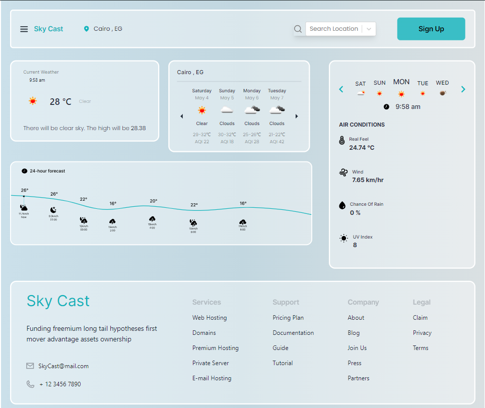

# Weather App

## Description

This Weather App is a simple application that provides users with current weather information for a specific location. It utilizes the OpenWeather API to fetch weather data and displays it in an intuitive user interface.

## Features
- Current weather data display (temperature, description, humidity, etc.).
- User-friendly interface.
- Integration with OpenWeather API for real-time weather updates.

## Installation

1. Clone the repository: `git clone [repository-url]`
2. Navigate to the project directory: `cd weather-app`
3. Open `index.html` in your preferred web browser.

## Usage

=======
1. Upon opening the app, users are prompted to enter a city name or zip code.
2. After submitting the location, the app fetches the current weather data from the OpenWeather API.
3. The retrieved weather information is displayed on the screen.

## API Integration

This app integrates with the [OpenWeather API](https://openweathermap.org/api) to retrieve weather data. Please note that a free API key is required for accessing the weather data. Instructions for obtaining an API key can be found on the OpenWeather website.

## Limitations

=======
This app integrates with the [OpenWeather API](https://openweathermap.org/api) to retrieve weather data. Please note that a free API key is required for accessing the weather data. Instructions for obtaining an API key can be found on the OpenWeather website.

## Limitations

- Due to API constraints, the 24-hour forecast feature is not available in this version of the app. Instead, a static image placeholder is utilized.
- The app's functionality may be affected if the OpenWeather API service is unavailable or the API key is invalid.

## Credits

- Weather icons provided by [OpenWeather](https://openweathermap.org/weather-conditions).

## License

=======
- Weather icons provided by [OpenWeather](https://openweathermap.org/weather-conditions).

## License

This project is licensed under the [MIT License](LICENSE).
